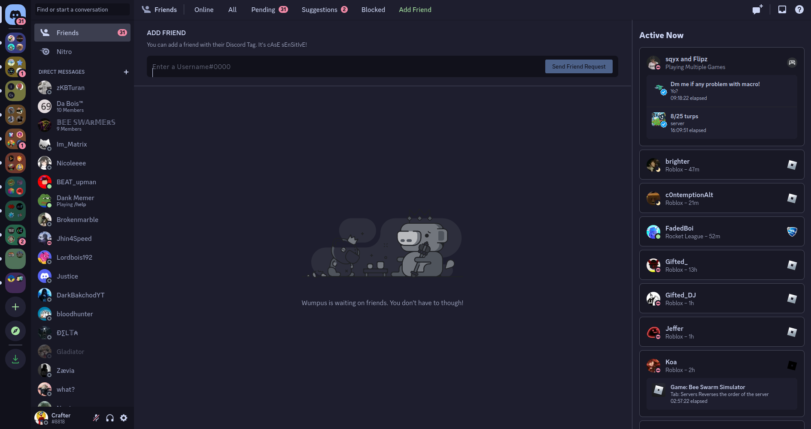

# Discord Theme Changer

This is customizes theme for Discord web that changes the look and feel of the app.



## Installation

1. Install the Violentmonkey browser extension for your browser.
2. Click on the Violentmonkey icon in your browser's toolbar and select "Create a new script".
3. Give your script a name and description and paste the following code in the editor:

```
// ==UserScript==
// @name         Discord Theme Changer
// @namespace    http://tampermonkey.net/
// @version      0.1
// @description  Change the theme of Discord on a web browser
// @author       Crafter
// @match        *://*/*
// @grant        none
// ==/UserScript==

(function() {
    'use strict';

    // Your CSS code for the theme goes here
    var css = `
        /* Put your theme CSS here */
    `;

    // Create a new style element
    var style = document.createElement("style");

    // Add the CSS code to the style element
    style.innerHTML = css;

    // Append the style element to the head of the document
    document.head.appendChild(style);
})();
```
3. Replace  /* Put your theme CSS here */  with your CSS code for the theme.

4. Save the script and reload Discord in your browser. The theme should now be applied.

## Usage

Once the theme is installed, it will change the look and feel of Discord on your browser.

## Notes

- Keep in mind that this is a third-party theme and there's no guarantee that it will work or that it won't cause any issues. Use it at your own risk.
- The theme will only affect the way Discord looks on your browser and will not affect the way it looks for other users.
- The changes will be lost when you close the browser.
- If you want to apply the theme permanently you have to host the css file and change the link of the css file in the script.

Keep in mind that the instructions for installing and using the theme may vary depending on the browser you are using and the version of Violentmonkey. Be sure to refer to the documentation for your specific setup for more detailed instructions.

## License

This theme is released under the [MIT License](https://opensource.org/licenses/MIT) or any other open source license you prefer.
